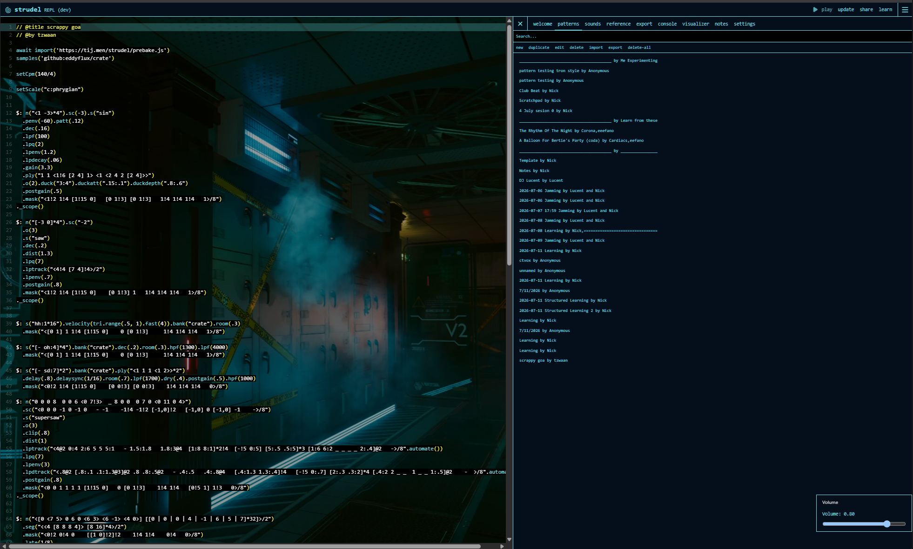
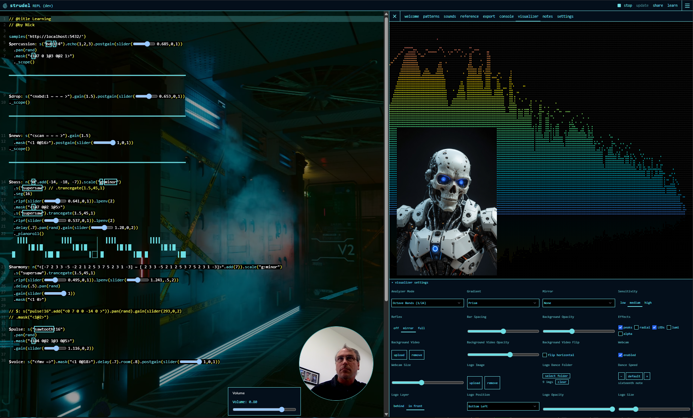

# strudel

Live coding patterns on the web

This fork represents the remarkable work of the Strudel team at its core. My contribution has been modest UI updates only, designed to increase capabilities, aesthetics, streaming and content creation workflows, and minor quality of life elements. 

**[See the updated Strudel UI in action](https://www.youtube.com/watch?v=XPp6b3VkmN0)**

---

## Screenshots





---

## Custom Modifications Overview

This fork of Strudel includes several substantial UI and experience enhancements built on top of the core live-coding engine:

### **1. Persistent Notes Tab**
A dedicated markdown documentation interface integrated into the main REPL. Allows users to maintain session notes, jam logs, and pattern documentation directly alongside their live code. Notes persist across sessions and are editable in real-time.

### **2. Pattern Highlighting & Navigation**
Enhanced pattern list UI with visual feedback—the currently-edited pattern is highlighted with high-contrast selection styling (black text on selection color), making it easier to track which pattern you're working on in multi-pattern sessions.

### **3. Rich Visual Feedback**
- **Dynamic Visualizations**: Real-time audio visualization tied to pattern playback
- **Background Video Layer**: Aesthetic background video integration for immersive jamming sessions
- **Animated Avatar**: Dancing avatar that responds to music playback, providing visual synchronization cues

### **4. Custom REPL Themes**
Multiple built-in color themes for the REPL editor, allowing users to customize the aesthetic of the coding environment. Includes support for switching themes on the fly.

### **5. Pattern Bridge Architecture**
A bridge system (`bridge/pattern.strudel`) enables external pattern files to be loaded and executed, supporting a modular workflow where patterns can be version-controlled and reloaded with sub-second latency.

### **6. Local Sample Management**
Integration with local Dirt Samples and custom sample banks via:
- Settings Prebake configuration
- Soundboard interface at `http://localhost:9100/soundboard.html`
- Support for both GitHub-hosted and local sample repositories

### **7. Native Webcamera Integration**
Embed live webcamera video natively into patterns for live coding performances, streaming, and content creation. Seamlessly layer video alongside audio synthesis and visualizations.

### **8. Optimized Key Bindings**
Custom keyboard shortcuts for common operations:
- **Ctrl+Enter**: Execute code
- **Ctrl+.**: Stop playback
- **Shift+Alt+Up**: Duplicate line

All modifications maintain compatibility with the core Strudel live-coding API and documentation while extending the user experience for local development and jamming workflows.

---


- Try it here: <https://strudel.cc>
- Docs: <https://strudel.cc/learn>
- Source: https://codeberg.org/uzu/strudel/
  * Along with many other live coding projects, we have moved from Microsoft's Github platform to Codeberg for ethical reasons. **Please don't fork the project back to github**.
- Technical Blog Post: <https://loophole-letters.vercel.app/strudel>
- 1 Year of Strudel Blog Post: <https://loophole-letters.vercel.app/strudel1year>
- 2 Years of Strudel Blog Post: <https://strudel.cc/blog/#year-2>


## Running Locally

After cloning the project, you can run the REPL locally:

1. Install [Node.js](https://nodejs.org/) 18 or newer
2. Install [pnpm](https://pnpm.io/installation)
3. Install dependencies by running the following command:
   ```bash
   pnpm i
   ```
4. Run the development server:
   ```bash
   pnpm dev
   ```

## Using Strudel In Your Project

This project is organized into many [packages](./packages), which are also available on [npm](https://www.npmjs.com/search?q=%40strudel).

Read more about how to use these in your own project [here](https://strudel.cc/technical-manual/project-start).

You will need to abide by the terms of the [GNU Affero Public Licence v3](LICENSE). As such, Strudel code can only be shared within free/open source projects under the same license -- see the license for details.

Licensing info for the default sound banks can be found over on the [dough-samples](https://github.com/felixroos/dough-samples/blob/main/README.md) repository.

## Contributing

There are many ways to contribute to this project! See [contribution guide](./CONTRIBUTING.md). You can find the full list of contributors [here](https://codeberg.org/uzu/strudel/activity/contributors).

## Community

There is a #strudel channel on the TidalCycles discord: <https://discord.com/invite/HGEdXmRkzT>

You can also ask questions and find related discussions on the tidal club forum: <https://club.tidalcycles.org/>

The discord and forum is shared with the haskell (tidal) and python (vortex) siblings of this project.

We also have a mastodon account: <a rel="me" href="https://social.toplap.org/@strudel">social.toplap.org/@strudel</a>
